### Hey there 👋

This is [Jason](//jsntn.com), an Emacs user stays a lot on [haikebang.org](//haikebang.org) recently.

📍 **Emacs Enthusiast** | 💻 **Open Source Developer** | 🛠️ **Tools & Productivity**

> Building tools for productivity and personal workflows. Passionate about Emacs, Org Mode, and creating efficient development environments.

## Featured Projects

### Emacs Ecosystem
- 🔧 **[emacs.d](https://github.com/jsntn/emacs.d)** - My personal Emacs configuration, refined since 2020 and harmonized across Windows, Linux, and macOS
- 📝 **[org-task-scheduler.el](https://github.com/jsntn/org-task-scheduler.el)** - Scan Org files to identify upcoming and missed scheduled/deadline tasks with notifications
- 📖 **[sdcv-pure.el](https://github.com/jsntn/sdcv-pure.el)** - Pure Elisp version of sdcv for StarDict dictionary lookup
- 🎴 **[mr-poker.el](https://github.com/jsntn/mr-poker.el)** - Practice memorizing poker cards within Emacs

### Web & Content
- 🎨 **[webfonts](https://github.com/jsntn/webfonts)** - Collection of web fonts in multiple formats (EOT, OTF, SVG, TTF, WOFF, WOFF2)
- 🗣️ **[talks](https://github.com/jsntn/talks)** - My talks ([jsntn.github.io/talks](https://jsntn.github.io/talks))
- 📓 **[note.jsntn.com](https://github.com/jsntn/note.jsntn.com)** - Personal notes site

### System Configuration & Tools
- 🔐 **[veracrypt-launcher](https://github.com/jsntn/veracrypt-launcher)** - Windows batch script for quickly mounting VeraCrypt volumes
- 🛡️ **[procguard](https://github.com/ahk-utils/procguard)** - AutoHotkey process monitoring and management utility
- 🖱️ **[move-cursor](https://github.com/ahk-utils/move-cursor)** - AutoHotkey script for enhanced cursor movement and control

## What I'm About

- **Emacs-Driven Workflow** - Living in Emacs and Org Mode for maximum productivity
- **Cross-Platform Harmony** - Building tools that work seamlessly across Windows, Linux, and macOS
- **Personal Knowledge Management** - Organizing information and tasks efficiently
- **Open Source** - Contributing to the community through useful tools and configurations

## Tech Stack

- **Editor**: Emacs (with extensive customization)
- **Languages**: Emacs Lisp, Python, Shell scripting, JavaScript
- **Tools**: Org Mode, Git, Linux command line
- **Focus**: Developer productivity, task management, knowledge organization

## Connect

---

### Philosophy

> "The right tool makes all the difference" - I believe in crafting personalized workflows and tools that enhance productivity and make development more enjoyable.

Random Facts

- Daily Emacs user since 2020
- Advocate for Org Mode/plain text as a life operating system
- Maintains cross-platform development environment
- Enjoys optimizing workflows and dotfiles
- Always exploring new productivity tools and techniques

<!--
**jsntn/jsntn** is a ✨ _special_ ✨ repository because its `README.md` (this file) appears on your GitHub profile.

Here are some ideas to get you started:

- 🔭 I’m currently working on ...
- 🌱 I’m currently learning ...
- 👯 I’m looking to collaborate on ...
- 🤔 I’m looking for help with ...
- 💬 Ask me about ...
- 📫 How to reach me: ...
- 😄 Pronouns: ...
- ⚡ Fun fact: ...
-->
